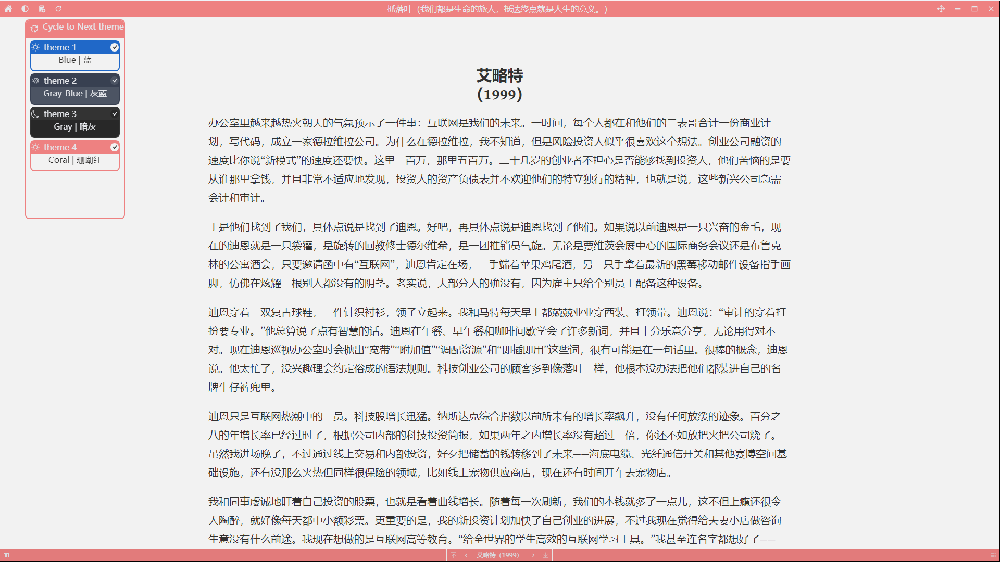

# Cozy Reader

一款轻量的阅读软件，仅支持ePub格式电子书。  

## 特点

- 页面干净，计算机资源占用低
- 阅读进度记忆
- 完全本地
- 滚动化阅读，支持漫画模式
- 跨平台
- 支持多种明、暗主题，支持自定义主题

## 限制

- 仅适用于DRM-free ePub 电子书

## 注意事项

- 部分包含数学公式的电子书使用图片显示公式，暗色主题下可能无法看清
- 少数ePub电子书制作不完全规范，章节显示会有问题。
- 部分操作结束后可能需要使用左上第4个按钮刷新重新加载

## 截图（v0.1.5）

  

## 反馈

- 欢迎提交issue反馈bug或提交新feature建议  
- 欢迎在issue中提交主题分享，请以 “\[主题分享\] 你的主题、描述等” 作为标题  

## 如何修改

1. 克隆仓库

   ```cmd
   git clone https://github.com/srsng/cozy-reader
   ```

2. 安装相关前置

   1. pnpm
   2. rust
   3. [tauri v2](https://v2.tauri.app/zh-cn/start/)

3. 安装必要依赖

   ```cmd
   pnpm install
   ```

4. 测试/构建

   ```cmd
   cargo tauri dev
   cargo tauri build
   ```

   （根据tauri配置选项不同会有所差异，详见tauri官方文档）

## 声明

Based on [Minimal-Reader](https://github.com/MattKevan/minimal-reader/) by [Matt Kevan](https://www.kevan.tv)   
