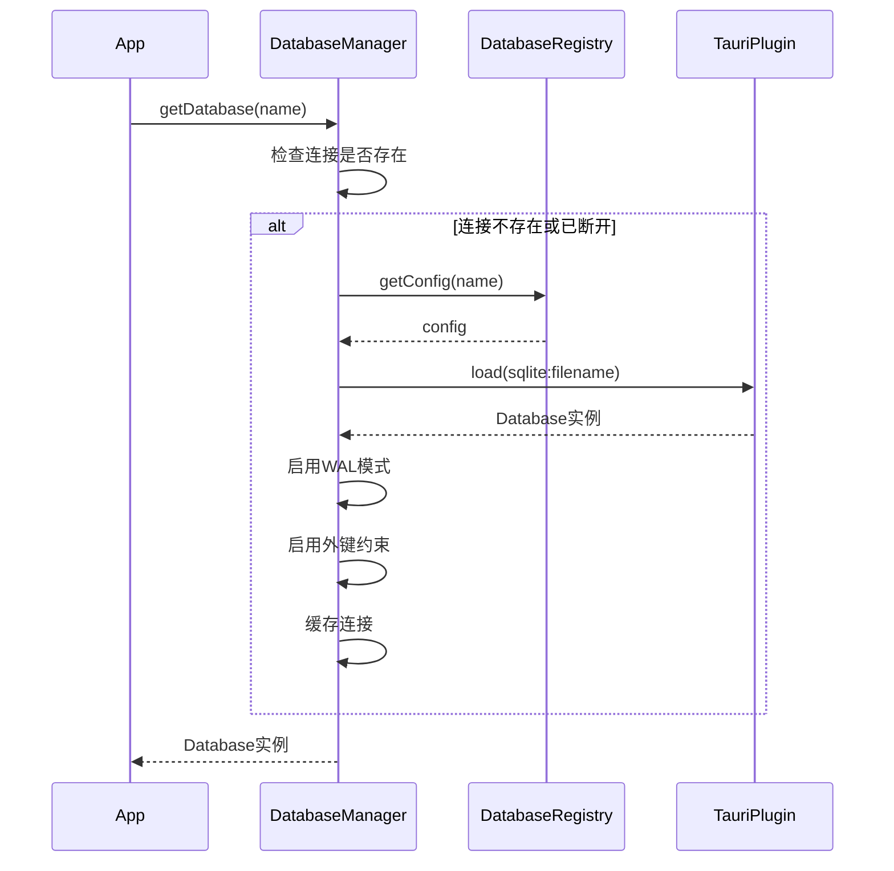
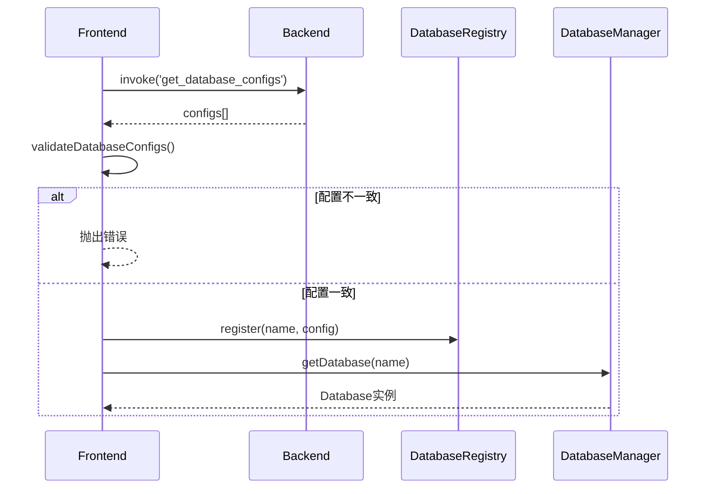
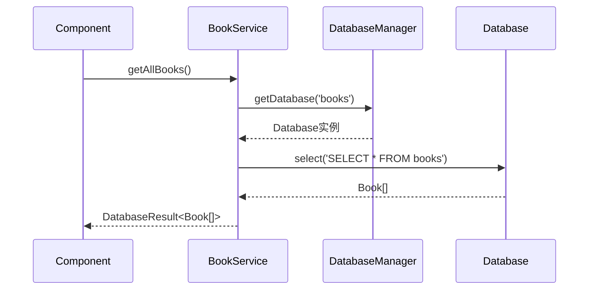

# 数据库架构文档（前端）

> **相关文档**：[后端数据库架构文档](../../../../crates/cozy-reader-tauri/src/database/README.md)  
> 本文档与后端文档互相关联，共同描述完整的数据库架构。

本文档描述 Cozy Reader 应用的前端数据库架构，包括数据库初始化、连接管理、服务层使用、事务管理和扩展方式。

## 目录

- [概述](#概述)
- [数据库初始化](#数据库初始化)
- [数据库配置](#数据库配置)
- [数据库连接管理](#数据库连接管理)
- [数据库注册表](#数据库注册表)
- [服务层使用](#服务层使用)
- [事务管理](#事务管理)
- [工具函数](#工具函数)
- [错误处理](#错误处理)
- [添加新数据库支持](#添加新数据库支持)
- [数据库架构图表](#数据库架构图表)

## 概述

前端数据库架构基于 **Tauri SQL Plugin**，通过 TypeScript 提供类型安全的数据库访问。应用采用多数据库架构，每个数据库实例都是独立的 SQLite 数据库文件。

### 与后端的关系

- **配置一致性**：前端和后端都定义完整的数据库配置，启动时进行一致性检查
- **迁移管理**：数据库迁移由后端 Tauri SQL Plugin 自动执行
- **连接管理**：前端负责数据库连接的创建、管理和生命周期

### 多数据库管理

应用支持多个独立的数据库实例，当前支持的数据库：

- `books` - 书籍、阅读会话和评论数据

## 数据库初始化

### initializeDatabases()

应用启动时必须调用 `initializeDatabases()` 函数来初始化所有数据库配置。

**位置**：`src/lib/database/init.ts`

**功能**：

1. 验证前后端配置一致性
2. 注册所有数据库配置到 `DatabaseRegistry`

**使用示例**：

```typescript
import { initializeDatabases } from '$lib/database';

// 在应用入口（如 +layout.ts）调用
export async function load({ params }) {
    try {
        await initializeDatabases();
        // ... 其他初始化逻辑
    } catch (error) {
        console.error('Failed to initialize databases:', error);
        throw error; // 配置不一致时应该抛出错误，阻止应用启动
    }
}
```

### validateDatabaseConfigs()

验证前后端数据库配置是否一致。

**检查项**：

- 数据库数量是否一致
- 每个数据库的 `name` 是否一致
- 每个数据库的 `filename` 是否一致
- 每个数据库的 `wal` 配置是否一致
- 前端是否有后端不存在的数据库

**错误处理**：如果配置不一致，会抛出详细的错误信息，包含具体的差异。

## 数据库配置

### DB_ENUM 枚举

定义所有数据库名称的枚举，用于类型安全：

```typescript
export enum DB_ENUM {
    books = 'books'
}

export type DB_NAME = `${DB_ENUM}`;
```

### DB_CONFIG_MAP 配置映射

定义所有数据库的完整配置，必须与后端 `DATABASES` 数组保持一致：

```typescript
export const DB_CONFIG_MAP: Record<DB_ENUM, DatabaseConfig> = {
    [DB_ENUM.books]: {
        name: 'books',
        filename: 'books.db',
        wal: true
    }
};
```

### 配置一致性要求

**重要**：前端和后端的数据库配置必须完全一致：

1. **数据库名称**：`name` 字段必须一致
2. **文件名**：`filename` 字段必须一致
3. **WAL 配置**：`wal` 字段必须一致

如果配置不一致，应用启动时会抛出错误，阻止应用运行。

## 数据库连接管理

### DatabaseManager 单例模式

`DatabaseManager` 负责管理所有数据库连接的生命周期。

**位置**：`src/lib/database/manager.ts`

**功能**：

- 连接创建和缓存
- 连接健康检查
- 自动重连
- WAL 模式配置
- 外键约束启用

### 连接管理流程图



### 使用示例

```typescript
import { DatabaseManager } from '$lib/database';
import { DB_ENUM } from '$lib/database/const';

const manager = DatabaseManager.getInstance();
const db = await manager.getDatabase(DB_ENUM.books);

// 执行查询
const books = await db.select<Book[]>('SELECT * FROM books WHERE deleted_at IS NULL');
```

### 连接健康检查

`DatabaseManager` 会自动检查连接健康状态：

- 每次 `getDatabase()` 调用时检查连接是否有效
- 如果连接断开，自动创建新连接
- 使用 `SELECT 1` 进行健康检查

### WAL 模式配置

如果数据库配置中 `wal: true`，连接创建时会自动启用 WAL 模式：

```typescript
if (config.wal) {
    await db.execute('PRAGMA journal_mode=WAL;');
}
```

WAL 模式提供更好的并发性能，适合多读少写的场景。

## 数据库注册表

### DatabaseRegistry

`DatabaseRegistry` 统一管理所有数据库的配置信息。

**位置**：`src/lib/database/registry.ts`

**功能**：

- 注册数据库配置
- 获取数据库配置
- 检查数据库是否已注册

**使用示例**：

```typescript
import { DatabaseRegistry } from '$lib/database';
import { DB_ENUM, DB_CONFIG_MAP } from '$lib/database/const';

// 注册数据库配置（通常在 initializeDatabases 中完成）
DatabaseRegistry.register(DB_ENUM.books, DB_CONFIG_MAP[DB_ENUM.books]);

// 获取配置
const config = DatabaseRegistry.getConfig(DB_ENUM.books);
```

## 服务层使用

### BookService 示例

服务层使用静态方法提供数据库操作：

```typescript
import { BookService } from '$lib/database/book';
import type { DatabaseResult, Book } from '$lib/database';

// 获取所有书籍
const result: DatabaseResult<Book[]> = await BookService.getAllBooks();
if (result.success) {
    const books = result.data || [];
} else {
    console.error('Error:', result.error);
}

// 创建书籍
const createResult = await BookService.createBook({
    path: '/path/to/book.md',
    title: 'My Book',
    format: BookFormat.MARKDOWN,
    storage_type: StorageType.FILESYSTEM,
    tags: []
});

// 更新书籍
const updateResult = await BookService.updateBook(bookId, {
    title: 'Updated Title',
    rating: 4.5
});
```

### 统一返回类型 DatabaseResult<T>

所有服务方法都返回 `DatabaseResult<T>` 类型：

```typescript
export interface DatabaseResult<T> {
    success: boolean;
    data?: T;
    error?: string;
}
```

**使用模式**：

```typescript
const result = await BookService.getAllBooks();
if (result.success) {
    // 使用 result.data
    const books = result.data || [];
} else {
    // 处理错误
    console.error(result.error);
}
```

### 服务层示例

#### ReadingSessionService

```typescript
import { ReadingSessionService } from '$lib/database/book';

// 创建阅读会话
const session = await ReadingSessionService.createSession({
    book_id: 1,
    start_progress: '{}'
});

// 结束阅读会话
await ReadingSessionService.endSession(sessionId, {
    end_progress: '{}',
    characters_read: 1000
});
```

#### CommentService

```typescript
import { CommentService } from '$lib/database/book';

// 创建评论
const comment = await CommentService.createComment({
    book_id: 1,
    content: 'Great book!',
    comment_type: 'review',
    tags: []
});

// 获取书籍的所有评论
const comments = await CommentService.getCommentsByBook(bookId);
```

## 事务管理

### 单数据库事务 Transaction

用于单个数据库的事务操作。

**位置**：`src/lib/database/transaction.ts`

**使用示例**：

```typescript
import { Transaction } from '$lib/database';
import { DB_ENUM } from '$lib/database/const';

await Transaction.run(DB_ENUM.books, async (tx) => {
    // 在事务中执行多个操作
    await tx.database.execute('INSERT INTO books (...) VALUES (...)');
    await tx.database.execute('UPDATE books SET ... WHERE id = ?', [id]);
    // 如果所有操作成功，事务会自动提交
    // 如果抛出异常，事务会自动回滚
});
```

**嵌套事务**（使用保存点）：

```typescript
await Transaction.run(DB_ENUM.books, async (tx) => {
    await tx.database.execute('INSERT INTO books (...) VALUES (...)');

    try {
        await tx.createSavepoint('sp1');
        await tx.database.execute('UPDATE books SET ...');
        await tx.releaseSavepoint('sp1');
    } catch (error) {
        await tx.rollbackToSavepoint('sp1');
        // 继续事务的其他操作
    }
});
```

### 跨数据库事务 MultiDatabaseTransaction

用于跨多个数据库的事务操作，使用两阶段提交实现。

**使用示例**：

```typescript
import { MultiDatabaseTransaction } from '$lib/database';
import { DB_ENUM } from '$lib/database/const';

await MultiDatabaseTransaction.run([DB_ENUM.books, DB_ENUM.otherDb], async (txes) => {
    const booksTx = txes.get(DB_ENUM.books)!;
    const otherTx = txes.get(DB_ENUM.otherDb)!;

    // 在多个数据库中执行操作
    await booksTx.database.execute('INSERT INTO books (...) VALUES (...)');
    await otherTx.database.execute('INSERT INTO other_table (...) VALUES (...)');

    // 如果所有操作成功，所有事务都会提交
    // 如果任何操作失败，所有事务都会回滚
});
```

**注意**：跨数据库事务使用两阶段提交，性能开销较大，应谨慎使用。

## 工具函数

### 时间工具

**位置**：`src/lib/database/utils/time.ts`

**函数**：

- `timestampToISOString(timestamp)` - Unix时间戳转ISO字符串
- `isoStringToTimestamp(isoString)` - ISO字符串转Unix时间戳
- `getCurrentTimestamp()` - 获取当前Unix时间戳（秒）
- `TimeFieldConverter` - 数据库字段转换工具类

**使用示例**：

```typescript
import { timestampToISOString, getCurrentTimestamp } from '$lib/database';

const now = getCurrentTimestamp();
const isoString = timestampToISOString(now);
```

### 软删除工具

**位置**：`src/lib/database/utils/softDelete.ts`

**函数**：

- `softDelete(db, table, id)` - 软删除记录
- `hardDelete(db, table, id)` - 硬删除记录
- `restoreDeleted(db, table, id)` - 恢复已删除的记录
- `buildSoftDeleteCondition()` - 构建软删除查询条件

**使用示例**：

```typescript
import { softDelete, buildSoftDeleteCondition } from '$lib/database/utils/softDelete';
import { getDatabase } from '$lib/database/book/config';

const db = await getDatabase();

// 软删除
await softDelete(db, 'books', bookId);

// 查询时过滤已删除的记录
const condition = buildSoftDeleteCondition();
const books = await db.select(`SELECT * FROM books WHERE ${condition}`);
```

### JSON 工具

**位置**：`src/lib/database/utils/json.ts`

**函数**：

- `isValidJSON(jsonString)` - 验证JSON字符串是否有效
- `safeParseJSON<T>(jsonString, defaultValue)` - 安全解析JSON字符串

**使用示例**：

```typescript
import { isValidJSON, safeParseJSON } from '$lib/database/utils/json';

const tagsJson = '["fiction", "sci-fi"]';
if (isValidJSON(tagsJson)) {
    const tags = safeParseJSON<string[]>(tagsJson, []);
}
```

### Book 特定工具

**位置**：`src/lib/database/book/utils.ts`

**函数**：

- `findBooksByTag(tag)` - 查询包含特定标签的书籍
- `findBooksByTags(tags)` - 查询包含任意指定标签的书籍

**使用示例**：

```typescript
import { findBooksByTag, findBooksByTags } from '$lib/database/book';

// 查找包含特定标签的书籍
const bookIds = await findBooksByTag('fiction');

// 查找包含任意指定标签的书籍
const bookIds2 = await findBooksByTags(['fiction', 'sci-fi']);
```

## 错误处理

### DatabaseError 类

统一的数据库错误类型，包含数据库上下文信息。

**位置**：`src/lib/database/types.ts`

**属性**：

- `message` - 错误消息
- `databaseName` - 数据库名称（可选）
- `code` - 错误代码（可选）
- `originalError` - 原始错误（可选）

**使用示例**：

```typescript
import { DatabaseError } from '$lib/database';
import { DB_ENUM } from '$lib/database/const';

try {
    // 数据库操作
} catch (error) {
    throw new DatabaseError('Failed to query books', DB_ENUM.books, 'QUERY_ERROR', error as Error);
}
```

### 错误上下文

所有数据库错误都应该包含数据库名称，便于调试和日志记录：

```typescript
// 错误消息格式：[databaseName] error message
// 例如：[books] Failed to query books
```

## 添加新数据库支持

### 步骤说明

1. **更新后端配置**（参考[后端文档](../../../../crates/cozy-reader-tauri/src/database/README.md)）

2. **更新前端枚举** (`src/lib/database/const.ts`)

    ```typescript
    export enum DB_ENUM {
        books = 'books',
        newDb = 'newDb' // 添加新数据库
    }
    ```

3. **更新配置映射** (`src/lib/database/const.ts`)

    ```typescript
    export const DB_CONFIG_MAP: Record<DB_ENUM, DatabaseConfig> = {
        [DB_ENUM.books]: {
            name: 'books',
            filename: 'books.db',
            wal: true
        },
        [DB_ENUM.newDb]: {
            // 添加新数据库配置
            name: 'newDb',
            filename: 'newDb.db',
            wal: true
        }
    };
    ```

4. **创建数据库配置文件** (`src/lib/database/newDb/config.ts`)

    ```typescript
    import type { DatabaseConfig } from '../types';
    import { DB_ENUM } from '../const';
    import { DatabaseRegistry } from '../registry';
    import { DatabaseManager } from '../manager';
    import type Database from '@tauri-apps/plugin-sql';

    export const DB_NEWDB_CONFIG: DatabaseConfig = {
        name: 'newDb',
        filename: 'newDb.db',
        wal: true
    };

    export async function getDatabase(): Promise<Database> {
        const manager = DatabaseManager.getInstance();
        return await manager.getDatabase(DB_ENUM.newDb);
    }
    ```

5. **创建服务层** (`src/lib/database/newDb/newDbService.ts`)

    ```typescript
    import { getDatabase } from './config';
    import type { DatabaseResult } from '../types';

    export class NewDbService {
        static async getAllItems(): Promise<DatabaseResult<Item[]>> {
            try {
                const db = await getDatabase();
                const items = await db.select<Item[]>(
                    'SELECT * FROM items WHERE deleted_at IS NULL'
                );
                return { success: true, data: items };
            } catch (error) {
                return {
                    success: false,
                    error: error instanceof Error ? error.message : 'Unknown error'
                };
            }
        }
    }
    ```

6. **创建类型定义** (`src/lib/database/newDb/item.ts`)

    ```typescript
    export interface Item {
        id: number;
        name: string;
        created_at: number;
        updated_at: number;
        deleted_at?: number;
    }
    ```

7. **创建导出文件** (`src/lib/database/newDb/index.ts`)

    ```typescript
    export { getDatabase } from './config';
    export { NewDbService } from './newDbService';
    export type { Item } from './item';
    ```

8. **更新主导出** (`src/lib/database/index.ts`)
    ```typescript
    export * from './newDb';
    ```

### 配置一致性检查

添加新数据库后，`validateDatabaseConfigs()` 会自动检查前后端配置是否一致。如果配置不一致，应用启动时会抛出错误。

## 数据库架构图表

### ER 图（实体关系图）

参考[后端文档](../../../../crates/cozy-reader-tauri/src/database/README.md#er-图实体关系图)中的 ER 图。

### 索引结构图

参考[后端文档](../../../../crates/cozy-reader-tauri/src/database/README.md#索引结构图)中的索引图。

### 数据库初始化流程图



### 服务层调用流程图



## 最佳实践

### 1. 始终使用服务层

不要直接访问数据库，而是通过服务层：

```typescript
// ✅ 正确
const result = await BookService.getAllBooks();

// ❌ 错误
const db = await getDatabase();
const books = await db.select('SELECT * FROM books');
```

### 2. 检查 DatabaseResult

始终检查 `success` 字段：

```typescript
const result = await BookService.getAllBooks();
if (!result.success) {
    // 处理错误
    console.error(result.error);
    return;
}
// 使用数据
const books = result.data || [];
```

### 3. 使用事务处理多个操作

对于需要原子性的多个操作，使用事务：

```typescript
await Transaction.run(DB_ENUM.books, async (tx) => {
    await BookService.createBook(...);
    await ReadingSessionService.createSession(...);
});
```

### 4. 软删除而非硬删除

优先使用软删除，保留数据以便恢复：

```typescript
import { softDelete } from '$lib/database/utils/softDelete';

await softDelete(db, 'books', bookId);
```

### 5. 查询时过滤已删除记录

所有查询都应该过滤 `deleted_at IS NULL`：

```typescript
const books = await db.select<Book[]>('SELECT * FROM books WHERE deleted_at IS NULL');
```

### 6. 使用类型安全

充分利用 TypeScript 类型系统：

```typescript
import type { Book } from '$lib/database/book';
import { DB_ENUM } from '$lib/database/const';

// 类型安全的数据库名称
const dbName: DB_ENUM = DB_ENUM.books;

// 类型安全的查询结果
const books: Book[] = await db.select<Book[]>('SELECT * FROM books');
```

## 相关文档

- [后端数据库架构文档](../../../../crates/cozy-reader-tauri/src/database/README.md) - 后端数据库配置和迁移指南
