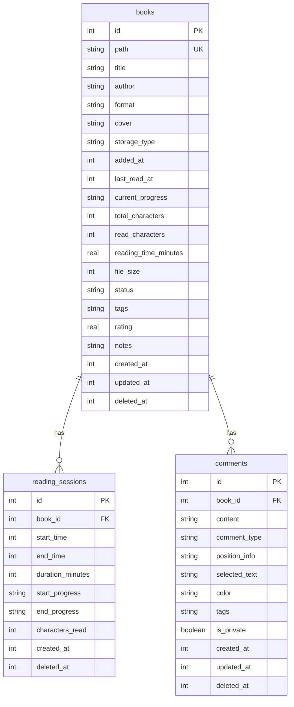

# 数据库架构文档（后端）

> **相关文档**：[前端数据库架构文档](../../../../apps/desktop/src/lib/database/README.md)  
> 本文档与前端文档互相关联，共同描述完整的数据库架构。

本文档描述 Cozy Reader 应用的后端数据库架构，包括数据库配置、迁移系统、Schema 设计和扩展方式。

## 目录

- [概述](#概述)
- [数据库配置](#数据库配置)
- [迁移系统](#迁移系统)
- [数据库 Schema 设计](#数据库-schema-设计)
- [索引设计](#索引设计)
- [触发器与约束](#触发器与约束)
- [添加新数据库](#添加新数据库)
- [添加新迁移](#添加新迁移)
- [Tauri 命令](#tauri-命令)

## 概述

Cozy Reader 使用 **SQLite** 作为数据库引擎，通过 **Tauri SQL Plugin** 进行数据库管理。应用支持多个独立的数据库实例，每个数据库都有自己的配置和迁移文件。

### 技术栈

- **数据库引擎**：SQLite 3
- **迁移系统**：Tauri SQL Plugin 官方迁移系统
- **并发模式**：WAL (Write-Ahead Logging)
- **时间存储**：Unix 时间戳（秒，INTEGER 类型）

### 多数据库支持

应用采用多数据库架构，每个数据库实例都是独立的 SQLite 数据库文件。当前支持的数据库：

- `books` - 书籍、阅读会话和评论数据

## 数据库配置

### DatabaseDefinition 结构体

所有数据库配置通过 `DatabaseDefinition` 结构体定义：

```rust
pub struct DatabaseDefinition {
    /// 数据库名称（如 "books"）
    pub name: &'static str,
    /// 数据库文件名（如 "books.db"）
    pub filename: &'static str,
    /// 是否启用 WAL 模式
    pub wal: bool,
    /// 迁移函数
    pub migrations: fn() -> Vec<Migration>,
}
```

### DATABASES 数组

所有数据库定义集中在 `src/database/config.rs` 的 `DATABASES` 数组中：

```rust
pub const DATABASES: &[DatabaseDefinition] = &[
    DatabaseDefinition {
        name: "books",
        filename: "books.db",
        wal: true,
        migrations: crate::database::migrations::books_migrations,
    },
    // 未来添加新数据库时，只需在这里添加一条记录
];
```

### 数据库注册流程

数据库在应用启动时通过 Tauri SQL Plugin 自动注册：

```rust
let mut sql_builder = tauri_plugin_sql::Builder::default();
for db in database::DATABASES {
    sql_builder = sql_builder
        .add_migrations(&format!("sqlite:{}", db.filename), (db.migrations)());
}
sql_builder.build()
```

## 迁移系统

### Tauri SQL Plugin 迁移机制

Tauri SQL Plugin 提供了官方的数据库迁移系统，支持版本管理和自动执行。

### 迁移文件组织方式

```
src/database/
├── migrations/
│   ├── mod.rs              # 导出所有数据库的迁移模块
│   └── books/
│       ├── books.rs        # books 数据库的迁移注册
│       └── 001_initial_schema.sql  # 迁移 SQL 文件
```

### 迁移注册

每个数据库的迁移在对应的 Rust 文件中注册：

```rust
use tauri_plugin_sql::{Migration, MigrationKind};

pub fn books_migrations() -> Vec<Migration> {
    vec![Migration {
        version: 1,
        description: "initial_schema",
        sql: include_str!("books/001_initial_schema.sql"),
        kind: MigrationKind::Up,
    }]
}
```

### 迁移版本管理

- 每个迁移都有一个唯一的版本号（`version`）
- 版本号必须递增
- Tauri SQL Plugin 会自动跟踪已执行的迁移
- 迁移只会执行一次，具有幂等性

## 数据库 Schema 设计

### ER 图（实体关系图）



### 表结构详细说明

#### books 表

存储书籍的基本信息和阅读进度。

| 字段名               | 类型    | 约束                                     | 说明                           |
| -------------------- | ------- | ---------------------------------------- | ------------------------------ |
| id                   | INTEGER | PRIMARY KEY AUTOINCREMENT                | 主键                           |
| path                 | TEXT    | NOT NULL UNIQUE                          | 文件路径（唯一）               |
| title                | TEXT    | NOT NULL                                 | 书名                           |
| author               | TEXT    |                                          | 作者                           |
| format               | TEXT    | NOT NULL                                 | 文件格式                       |
| cover                | TEXT    |                                          | 封面路径                       |
| storage_type         | TEXT    | NOT NULL                                 | 存储类型                       |
| added_at             | INTEGER | NOT NULL DEFAULT (strftime('%s', 'now')) | 添加时间（Unix时间戳）         |
| last_read_at         | INTEGER |                                          | 最后阅读时间（Unix时间戳）     |
| current_progress     | TEXT    | NOT NULL DEFAULT '{}'                    | 当前进度（JSON）               |
| total_characters     | INTEGER | NOT NULL DEFAULT 0                       | 总字符数                       |
| read_characters      | INTEGER | NOT NULL DEFAULT 0                       | 已读字符数                     |
| reading_time_minutes | REAL    | NOT NULL DEFAULT 0.0                     | 阅读时长（分钟）               |
| file_size            | INTEGER | NOT NULL DEFAULT 0                       | 文件大小（字节）               |
| status               | TEXT    | NOT NULL DEFAULT 'not_started'           | 阅读状态                       |
| tags                 | TEXT    | NOT NULL DEFAULT '[]'                    | 标签（JSON数组）               |
| rating               | REAL    | CHECK (rating >= 0 AND rating <= 5)      | 评分（0-5）                    |
| notes                | TEXT    |                                          | 备注                           |
| created_at           | INTEGER | NOT NULL DEFAULT (strftime('%s', 'now')) | 创建时间（Unix时间戳）         |
| updated_at           | INTEGER | NOT NULL DEFAULT (strftime('%s', 'now')) | 更新时间（Unix时间戳）         |
| deleted_at           | INTEGER |                                          | 删除时间（Unix时间戳，软删除） |

**状态枚举值**：`not_started`, `reading`, `completed`, `paused`

#### reading_sessions 表

记录每次阅读会话的详细信息。

| 字段名           | 类型    | 约束                                     | 说明                           |
| ---------------- | ------- | ---------------------------------------- | ------------------------------ |
| id               | INTEGER | PRIMARY KEY AUTOINCREMENT                | 主键                           |
| book_id          | INTEGER | NOT NULL, FOREIGN KEY                    | 书籍ID（外键）                 |
| start_time       | INTEGER | NOT NULL DEFAULT (strftime('%s', 'now')) | 开始时间（Unix时间戳）         |
| end_time         | INTEGER |                                          | 结束时间（Unix时间戳）         |
| duration_minutes | INTEGER | DEFAULT 0                                | 持续时间（分钟）               |
| start_progress   | TEXT    |                                          | 开始进度（JSON）               |
| end_progress     | TEXT    |                                          | 结束进度（JSON）               |
| characters_read  | INTEGER | DEFAULT 0                                | 本次阅读字符数                 |
| created_at       | INTEGER | NOT NULL DEFAULT (strftime('%s', 'now')) | 创建时间（Unix时间戳）         |
| deleted_at       | INTEGER |                                          | 删除时间（Unix时间戳，软删除） |

**外键约束**：`FOREIGN KEY (book_id) REFERENCES books(id) ON DELETE CASCADE`

#### comments 表

存储用户对书籍的注释、高亮、书签和评论。

| 字段名        | 类型    | 约束                                     | 说明                           |
| ------------- | ------- | ---------------------------------------- | ------------------------------ |
| id            | INTEGER | PRIMARY KEY AUTOINCREMENT                | 主键                           |
| book_id       | INTEGER | NOT NULL, FOREIGN KEY                    | 书籍ID（外键）                 |
| content       | TEXT    | NOT NULL                                 | 评论内容                       |
| comment_type  | TEXT    | NOT NULL DEFAULT 'note'                  | 评论类型                       |
| position_info | TEXT    |                                          | 位置信息（JSON）               |
| selected_text | TEXT    |                                          | 选中的文本                     |
| color         | TEXT    | DEFAULT '#ffeb3b'                        | 高亮颜色                       |
| tags          | TEXT    | DEFAULT '[]'                             | 标签（JSON数组）               |
| is_private    | BOOLEAN | DEFAULT 1                                | 是否私有                       |
| created_at    | INTEGER | NOT NULL DEFAULT (strftime('%s', 'now')) | 创建时间（Unix时间戳）         |
| updated_at    | INTEGER | NOT NULL DEFAULT (strftime('%s', 'now')) | 更新时间（Unix时间戳）         |
| deleted_at    | INTEGER |                                          | 删除时间（Unix时间戳，软删除） |

**外键约束**：`FOREIGN KEY (book_id) REFERENCES books(id) ON DELETE CASCADE`

**评论类型枚举值**：`note`, `highlight`, `bookmark`, `review`

### 字段类型说明

#### 时间字段

所有时间字段使用 `INTEGER` 类型存储 Unix 时间戳（秒）。默认值使用 `strftime('%s', 'now')` 获取当前时间戳。

**示例**：

```sql
created_at INTEGER NOT NULL DEFAULT (strftime('%s', 'now'))
```

#### JSON 字段

以下字段存储 JSON 格式的数据：

- `books.current_progress` - 阅读进度对象
- `books.tags` - 标签数组
- `reading_sessions.start_progress` - 开始进度对象
- `reading_sessions.end_progress` - 结束进度对象
- `comments.position_info` - 位置信息对象
- `comments.tags` - 标签数组

所有 JSON 字段都有触发器验证，确保数据格式正确。

#### 软删除字段

所有表都包含 `deleted_at` 字段用于软删除：

- `NULL` 表示未删除
- 非 `NULL` 值表示删除时间（Unix时间戳）

查询时应该过滤 `deleted_at IS NULL` 的记录。

## 索引设计

### 索引结构图

```mermaid
graph TD
    A[books表] --> B[单列索引]
    A --> C[复合索引]

    B --> B1[idx_books_path<br/>path]
    B --> B2[idx_books_status<br/>status]
    B --> B3[idx_books_added_at<br/>added_at]
    B --> B4[idx_books_last_read_at<br/>last_read_at]
    B --> B5[idx_books_title<br/>title]
    B --> B6[idx_books_author<br/>author]
    B --> B7[idx_books_deleted_at<br/>deleted_at]

    C --> C1[idx_books_status_added_at<br/>status, added_at DESC]
    C --> C2[idx_books_status_last_read_at<br/>status, last_read_at DESC]

    D[reading_sessions表] --> E[单列索引]
    D --> F[复合索引]

    E --> E1[idx_reading_sessions_book_id<br/>book_id]
    E --> E2[idx_reading_sessions_start_time<br/>start_time]
    E --> E3[idx_reading_sessions_deleted_at<br/>deleted_at]

    F --> F1[idx_reading_sessions_book_start_time<br/>book_id, start_time DESC]
    F --> F2[idx_reading_sessions_book_end_start<br/>book_id, end_time, start_time DESC]

    G[comments表] --> H[单列索引]
    G --> I[复合索引]

    H --> H1[idx_comments_book_id<br/>book_id]
    H --> H2[idx_comments_type<br/>comment_type]
    H --> H3[idx_comments_created_at<br/>created_at]
    H --> H4[idx_comments_deleted_at<br/>deleted_at]

    I --> I1[idx_comments_book_type_created<br/>book_id, comment_type, created_at DESC]
    I --> I2[idx_comments_book_created<br/>book_id, created_at DESC]
```



### 索引使用场景

#### books 表索引

- **idx_books_path**: 用于根据文件路径快速查找书籍
- **idx_books_status**: 用于按状态筛选书籍
- **idx_books_added_at**: 用于按添加时间排序
- **idx_books_last_read_at**: 用于按最后阅读时间排序
- **idx_books_title**: 用于标题搜索
- **idx_books_author**: 用于作者搜索
- **idx_books_deleted_at**: 用于软删除过滤
- **idx_books_status_added_at**: 用于按状态和添加时间组合查询
- **idx_books_status_last_read_at**: 用于按状态和最后阅读时间组合查询

#### reading_sessions 表索引

- **idx_reading_sessions_book_id**: 用于查找特定书籍的所有会话
- **idx_reading_sessions_start_time**: 用于按时间范围查询会话
- **idx_reading_sessions_deleted_at**: 用于软删除过滤
- **idx_reading_sessions_book_start_time**: 用于查找书籍的会话并按时间排序
- **idx_reading_sessions_book_end_start**: 用于查找已结束的会话

#### comments 表索引

- **idx_comments_book_id**: 用于查找特定书籍的所有评论
- **idx_comments_type**: 用于按类型筛选评论
- **idx_comments_created_at**: 用于按创建时间排序
- **idx_comments_deleted_at**: 用于软删除过滤
- **idx_comments_book_type_created**: 用于查找书籍的特定类型评论并按时间排序
- **idx_comments_book_created**: 用于查找书籍的所有评论并按时间排序

## 触发器与约束

### updated_at 自动更新触发器

当特定字段更新时，自动更新 `updated_at` 字段。

**books 表触发器**：

```sql
CREATE TRIGGER IF NOT EXISTS update_books_updated_at
AFTER UPDATE OF title, author, format, cover, storage_type, current_progress,
                 total_characters, read_characters, reading_time_minutes, file_size,
                 status, tags, rating, notes, last_read_at ON books
FOR EACH ROW
BEGIN
    UPDATE books SET updated_at = strftime('%s', 'now') WHERE id = NEW.id;
END;
```

**comments 表触发器**：

```sql
CREATE TRIGGER IF NOT EXISTS update_comments_updated_at
AFTER UPDATE OF content, comment_type, position_info, selected_text,
                 color, tags, is_private ON comments
FOR EACH ROW
BEGIN
    UPDATE comments SET updated_at = strftime('%s', 'now') WHERE id = NEW.id;
END;
```

### CHECK 约束触发器

使用触发器实现 CHECK 约束（SQLite 不支持列级 CHECK 约束）。

**books 表约束**：

- `total_characters >= 0`
- `read_characters >= 0 AND read_characters <= total_characters`
- `file_size >= 0`
- `status IN ('not_started', 'reading', 'completed', 'paused')`
- `rating >= 0 AND rating <= 5`

**reading_sessions 表约束**：

- `duration_minutes >= 0`
- `characters_read >= 0`

### JSON 验证触发器

所有 JSON 字段都有触发器验证，确保存储的数据是有效的 JSON。

**验证的字段**：

- `books.tags`
- `books.current_progress`
- `comments.tags`
- `comments.position_info`

**示例触发器**：

```sql
CREATE TRIGGER IF NOT EXISTS validate_books_tags_json
BEFORE INSERT ON books
FOR EACH ROW
WHEN NEW.tags IS NOT NULL
BEGIN
    SELECT CASE
        WHEN json_valid(NEW.tags) IS NULL THEN
            RAISE(ABORT, 'tags must be valid JSON')
    END;
END;
```

## 添加新数据库

### 步骤说明

1. **创建迁移目录和文件**

    ```
    src/database/migrations/
    └── new_db/
        ├── new_db.rs
        └── 001_initial_schema.sql
    ```

2. **创建迁移注册文件** (`new_db.rs`)

    ```rust
    use tauri_plugin_sql::{Migration, MigrationKind};

    pub fn new_db_migrations() -> Vec<Migration> {
        vec![Migration {
            version: 1,
            description: "initial_schema",
            sql: include_str!("new_db/001_initial_schema.sql"),
            kind: MigrationKind::Up,
        }]
    }
    ```

3. **在 `migrations/mod.rs` 中导出**

    ```rust
    pub mod new_db;
    pub use new_db::new_db_migrations;
    ```

4. **在 `config.rs` 中添加数据库定义**

    ```rust
    DatabaseDefinition {
        name: "new_db",
        filename: "new_db.db",
        wal: true,
        migrations: crate::database::migrations::new_db_migrations,
    }
    ```

5. **更新前端配置**（参考[前端文档](../../../../apps/desktop/src/lib/database/README.md)）

### 代码示例

完整的 `new_db.rs` 示例：

```rust
use tauri_plugin_sql::{Migration, MigrationKind};

/// NewDB 数据库的所有迁移
pub fn new_db_migrations() -> Vec<Migration> {
    vec![
        Migration {
            version: 1,
            description: "initial_schema",
            sql: include_str!("new_db/001_initial_schema.sql"),
            kind: MigrationKind::Up,
        },
        // 未来可以添加更多迁移
        // Migration {
        //     version: 2,
        //     description: "add_new_feature",
        //     sql: include_str!("new_db/002_add_new_feature.sql"),
        //     kind: MigrationKind::Up,
        // },
    ]
}
```

## 添加新迁移

### 迁移文件命名规范

迁移文件使用以下命名格式：

```
{版本号}_{描述}.sql
```

**示例**：

- `001_initial_schema.sql`
- `002_add_user_preferences.sql`
- `003_add_full_text_search.sql`

### 迁移内容编写

迁移文件应该包含完整的 SQL 语句，可以是：

- 创建表
- 修改表结构（添加/删除列）
- 创建索引
- 创建触发器
- 数据迁移

**示例** (`002_add_user_preferences.sql`)：

```sql
-- 添加用户偏好设置表
CREATE TABLE IF NOT EXISTS user_preferences (
    id INTEGER PRIMARY KEY AUTOINCREMENT,
    key TEXT NOT NULL UNIQUE,
    value TEXT NOT NULL,
    created_at INTEGER NOT NULL DEFAULT (strftime('%s', 'now')),
    updated_at INTEGER NOT NULL DEFAULT (strftime('%s', 'now'))
);

CREATE INDEX IF NOT EXISTS idx_user_preferences_key ON user_preferences(key);
```

### 注册迁移

在对应的迁移注册文件中添加新的迁移：

```rust
pub fn books_migrations() -> Vec<Migration> {
    vec![
        Migration {
            version: 1,
            description: "initial_schema",
            sql: include_str!("books/001_initial_schema.sql"),
            kind: MigrationKind::Up,
        },
        Migration {
            version: 2,
            description: "add_user_preferences",
            sql: include_str!("books/002_add_user_preferences.sql"),
            kind: MigrationKind::Up,
        },
    ]
}
```

### 迁移最佳实践

1. **幂等性**：迁移应该可以安全地多次执行
    - 使用 `CREATE TABLE IF NOT EXISTS`
    - 使用 `CREATE INDEX IF NOT EXISTS`
    - 使用 `CREATE TRIGGER IF NOT EXISTS`

2. **向后兼容**：新迁移不应该破坏现有数据
    - 添加列时使用 `DEFAULT` 值
    - 删除列前先迁移数据

3. **版本号递增**：版本号必须严格递增

4. **描述清晰**：`description` 字段应该清楚地说明迁移的目的

## Tauri 命令

### get_database_configs

返回所有数据库的配置信息，供前端进行一致性检查。

**定义** (`src/database/commands.rs`)：

```rust
#[tauri::command]
pub fn get_database_configs() -> Vec<DatabaseConfigResponse> {
    DATABASES
        .iter()
        .map(|db| DatabaseConfigResponse {
            name: db.name.to_string(),
            filename: db.filename.to_string(),
            wal: db.wal,
        })
        .collect()
}
```

**响应格式**：

```rust
pub struct DatabaseConfigResponse {
    pub name: String,
    pub filename: String,
    pub wal: bool,
}
```

**注册** (`src/lib.rs`)：

```rust
.invoke_handler(tauri::generate_handler![
    // ... other commands
    database::commands::get_database_configs
])
```

**前端调用**：

```typescript
const configs = await invoke<DatabaseConfigResponse[]>('get_database_configs');
```

## 相关文档

- [前端数据库架构文档](../../../../apps/desktop/src/lib/database/README.md) - 前端数据库使用和扩展指南
