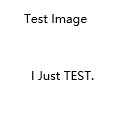

# Markdown 渲染样例

这个文件用于人工浏览 MD 阅读器的组件渲染效果。覆盖常见 Markdown token，便于检查排版、嵌套和边界表现。

## 行内文本

普通文本、**加粗文本**、_斜体文本_、~~删除线文本~~、`inline code`、[链接文本](https://example.com)。

中文、English、数字 123、标点符号：，。！？；：都放在同一段里，用于观察行高和换行。

## 标题层级

# H1 标题

## H2 标题

### H3 标题

#### H4 标题

##### H5 标题

###### H6 标题

---

## 引用

> 一级引用内容。
>
> 第二段引用里包含 **加粗**、_斜体_、~~删除线~~ 和 `code`。

## 列表

- 无序列表第一项
- 无序列表第二项，包含 **加粗**
    - 嵌套无序列表
    - 嵌套项带 `inline code`

1. 有序列表第一项
2. 有序列表第二项
    1. 嵌套有序列表
    2. 嵌套项带 ~~删除线~~

## 任务列表

- [x] 已完成任务
- [ ] 未完成任务
- [x] 已完成任务，包含 **加粗**、`code` 和 [链接](https://example.com/docs)

## 代码块

```ts
type Book = {
    id: string;
    title: string;
    progress: number;
};

function formatProgress(book: Book): string {
    return `${book.title}: ${Math.round(book.progress * 100)}%`;
}
```

```json
{
    "theme": "light",
    "fontSize": 18,
    "features": ["table", "task-list", "math", "code"]
}
```

## 表格

| 组件     |      状态      |              备注 |
| -------- | :------------: | ----------------: |
| 代码块   |   **已实现**   |     `<pre><code>` |
| 删除线   | ~~旧实现缺失~~ |           `<del>` |
| 任务列表 |      [x]       | disabled checkbox |
| 表格     |   **已实现**   |          支持对齐 |

## 图片

下面是图片语法占位，用于检查图片组件。


## 数学公式

行内公式：当 $a^2 + b^2 = c^2$ 时，可以用来检查 inline math 的基线位置。

块级公式：

$$
\int_0^1 x^2\,dx = \frac{1}{3}
$$

括号公式：

\[
E = mc^2
\]

## HTML

<div style="padding: 8px; border: 1px solid currentColor;">
    这是一段原始 HTML，用于检查 html renderer。
</div>

使用html渲染图片能看到 alt 行为或加载失败状态。



## 换行

第一行后面有两个空格。  
这一行应该显示为软换行后的新行。

普通换行
在 GFM breaks 打开时也应该换行显示。
